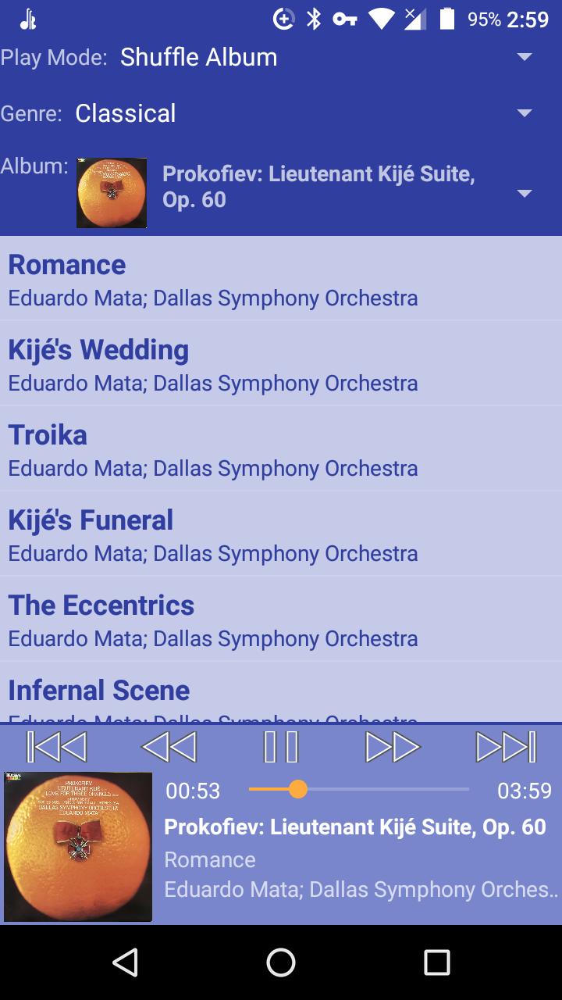
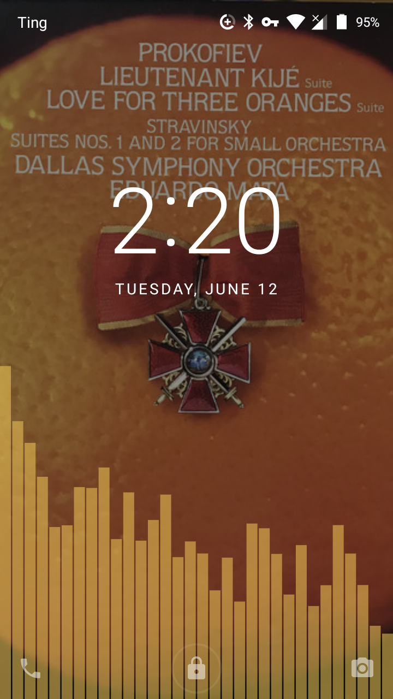
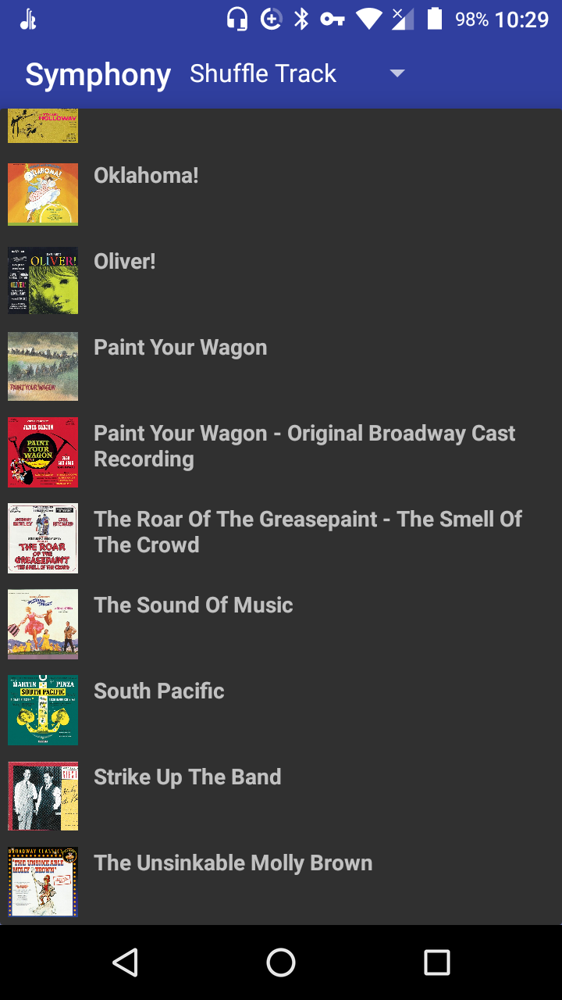

Symphony - A music player for Android
=====================================
Yet another music player for Android. What makes this one different is that it supports shuffle playing of albums within a genre.
It is tailored toward playing classical music and other genres where you wish to listen to random albums (symphonies) with the songs/tracks (movements) played in the correct order.

Features
========
- “Gap-less” playback.
- Very simple interface.
- Within a genre, tracks may be played in sequence, randomly, or by random albums.

Screenshots
===========

Frequently Asked Questions
==========================
[See our FAQ page.](FAQ.md)

Operation
=========
Symphony gets the list of genres for music stored locally on the phone from the Android system.

When a genre is selected, a playlist is created from all the songs in the genre sorted by album and within album by track number.

To make it easy to access a specific album a selector is presented with the names of all albums in the list. When an album is selected the playlist is scrolled to the first song on the album.

Playback can be sequential (all tracks for all albums in alphabetical order of album name), by random track/song or by random album.

The result is that if you select a classical genre then you can sequentially or randomly play all the albums (performances/compositions) in the genre, with the movements (songs) in the correct order.

Copyright
=========
This program is Free Software: you can redistribute it and/or modify it under the terms of the GNU General Public License as published by the Free Software Foundation, either version 3 of the License, or (at your option) any later version.

Other
=====
The media control icons for this app are from the [GNOME Desktop icons](https://commons.wikimedia.org/wiki/GNOME_Desktop_icons) set.

Permissions
===========
|Permission|Use|
|:----------|:---|
READ_EXTERNAL_STORAGE|Needed to access music stored on your microSD card.
WAKE_LOCK|So the player can go to the background without stopping

Update History
==============
[History is now a separate file](CHANGELOG.md).

Privacy Policy
==============
[Please read our privacy policy.](PRIVACY.md)

